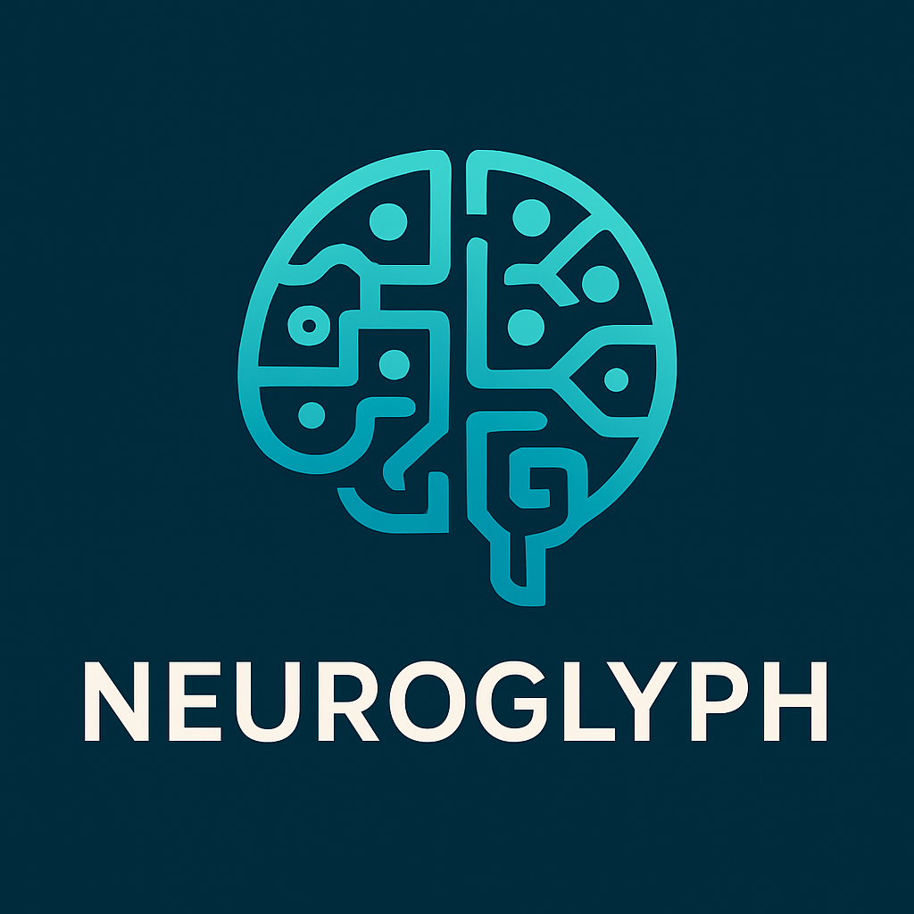

# NeuroGlyph

<p align="center">
  
  <br/>
  <strong>NeuroGlyph: Language for Contextual & Relational Thought</strong>
</p>


NeuroGlyph is a symbolic communication protocol designed for structured, multimodal, and multi-agent dialogue. It combines task management, creative collaboration, open-ended research, and meta-dialogue within a compact and expressive language based on emoji-glyphs and structured tags.

## 🧠 What is NeuroGlyph?

NeuroGlyph allows human and AI agents to communicate goals, contexts, and interactions efficiently using composable tokens. It supports:
- Cognitive tasks
- Research dialogue
- Collective creative projects
- Meta-programming
- Graph-level compression for agent-to-agent protocols

## 📚 What's Inside

- `/docs/NeuroGlyph_Manual_v3.7+.pdf` — Complete protocol reference
- `/docs/User_Guide.pdf` — Real-world usage examples
- `/examples/` — Sample dialogues, collaborative writing, and music composition
- `/specs/` — Optional encoding/graph specs for developers

## 🚀 Quick Start

To use NeuroGlyph:
1. Load the `Manual` and `User Guide` into any LLM interface
2. Begin with a command like:

```neuroglyph
🚀 /act:begin_dialogue
👁️ /focus:"emergent agency"
🤝 /mind:user ↔ GPT
🧠 /intent:explore
```

## 🤖 Future Development

Upcoming features include:
- GraphGlyph: a compressed DAG representation for fast communication
- Agent-to-agent fast mode (GibberLink-style)
- Visual composer interface

## 🧭 License

MIT — free to use, modify, and adapt.

---

Made with ❤️ by Mirco and the NeuroGlyph collective.
